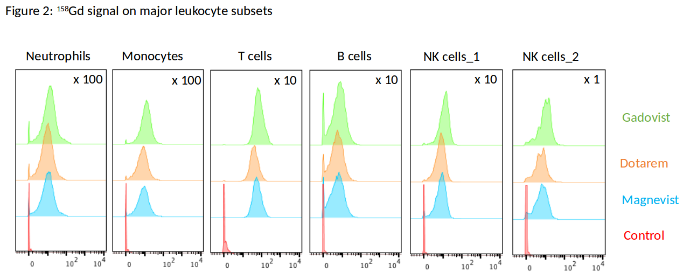

```{r setup, include=FALSE}
knitr::opts_chunk$set(echo = TRUE)
knitr::opts_chunk$set(root.dir = "/home/ericbarnhill/Documents/code/R/masscyto_R")
require(EasyABC)
require(gdata)
require(tidyr)
require(rlist)
require(ggplot2)
require(HDInterval)
require(reshape2)
require(rjags)
require(RColorBrewer)
require(plyr)
```

## Introduction

The goal of this experiment was to estimate robustness and uncertainty of effects in a mass cytometry  experiment. In this experiment, the response of contrast agents in six cell types was studied. As the cell types behave biologically differently, a separate statistical model was built for each.

In each model, three experiments were run, in which cell samples were subjected to three differing contrast agents:

- Magnevist
- Dotarem
- Gadevist

and a control condition. Cells were subjected to these agents at three differing concentrations: 0.1, 0.3, and 1, and the control condition was considered a concentration of 0.0. Thus a fully specified model for the experiment would be:

$$
E(Y_{ijk}) = \beta_{0} + u_{0j} + w_{0k} + (\beta_{1} + u_{1j} + w_{1k})conc_{i} + \epsilon_{i}
$$
where $\beta_{0}$ is the global intercept, $u_{0j}$ is a random intercept for experiment, $w_{0k}$ is a random intercept for contrast agent, and similarly, $\beta_{1}$, $u_{1j}$ and $w_{1k}$ are adjustments to the slope of the continuous concentration variable $conc$.

The data were acquired with a mass cytometer which provides several thousand measurements for each category. A summary plot from the mass cytometer for one experiment is below:


For this experiment we asked the scientific question: Does the cell signal change with contrast agent, for a given concentration?

Interpretation of this data with a rigorous statistical model posed two major challenges:

- Mass cytometry data is rarely handled in its raw form, which contains millions of samples. Rather, the cytometer outputs four summary statistics: 10% quantile, mean, median, and 90% quantile. To model uncertainty, the underlying distribution of each experimental condition had to be estimated.
- Once the distributions for each condition were estimated, iterative model-building was required to estimate impact of contrast agent.

## Data exploration

Data were cleaned and converted to tall format:


```{r}
source('masscyto_clean_gather_data.R')
MASSCYTO_DIR = "/home/ericbarnhill/Documents/code/R/masscyto_R/"
mass_cyto_xls_path <- file.path(MASSCYTO_DIR, "experimental_data.xlsx")
mass_cyto <- read.xls(xls=mass_cyto_xls_path, header=FALSE, skip=3, nrows=30)[,-(5:10)]
mass_cyto_tall <- clean_gather_data(mass_cyto)
str(mass_cyto_tall)
```

Medians for each experimental condition are explored below:

```{r, fig.height = 3.5, fig.width = 7}
source('masscyto_explore_medians.R')
m <- explore_medians(mass_cyto_tall)
```

We point out two key properties for modeling this data. 

First, there is considerable overlap between results, as the concentration approaches zero, for contrast agents and experiments. Consequently, within each of the six cell types, there is unlikely to be an independent intercept for either contrast agent or experiment. Rather, the variable quantity is the *slope of the lines*, that is, the increase in signal for each unit of concentration. The response of the signal to concentration appears approximately linear and therefore it appears appropriate to model the slope linearly.

Second, the third experiment (longer dashes) `r 3+2` overall appeared higher than the other experiments while the first and second experiment values appeared similar. A boxplot confirms that the median is, for each data set, looking higher on the third experiment:

```{r, fig.height = 4, fig.width = 10}
plt <- ggplot(subset(mass_cyto_tall, MeasurementType  == "Median" & ContrastAgent != "control")) +
    geom_point(aes(y=value, x=Concentration, group=ContrastAgent, col=ContrastAgent)) +
    facet_wrap(~ CellType, scales="free", ncol=3)
print(plt)
```
Next we move on from medians alone to overall summary statistics, to evaluate the distribution of values:
```{r, fig.height = 4, fig.width = 10}
source('masscyto_quantiles_table.R')
qt <- quantiles_table(mass_cyto_tall)
```
Here we can see that the mean is consistently higher than the median, and the data shows heavy right skew. This suggests that a normal model is inappropriate for the data and a gamma or lognormal model would be more suitable. The principal criterion for deciding between these two models is whether the log of the distribution is normal (lognormal) or has left skew (gamma). Fortunately part of the mass cytometer output is histograms of the distributions as shown in Figure 1. Consequently inspection shows that the distributions have some left skew, and a gamma model was chosen.

## Generation of parameter distributions: Methods

The first step in creating the statistical model was to generate a statistical distribution for each experimental condition that best approximated the four summary statistics of mean, median, 5% and 95%. Two common methods are maximum-likelihood estimation (MLE) and the method of moments (MOM). However, it is well known that in gamma distributions, deviation of the data from the model can cause very different estimates in both of these methods, and there is a uniqueness problem. Consequently distributions were additionally estimated using Approximate Bayesian Computation (ABC). ABC samples repeatedly over the parameter space to generate model-free estimates of the parameters. ABC has the additional benefit that the uncertainty of the fit to a typical gamma distribution is estimated. To sample over a gamma model with the above four summary statistics, the following ABC model was used:
```{r}
gamma_model <- function(par){ 
    samples <- rgamma(10000, shape=par[1], rate=par[2])
    mn <- mean(samples)
    mdn <- median(samples)
    qtls <- quantile(samples, c(0.05, 0.95))
    sum_stats <- c(mn, mdn, qtls[1], qtls[2])
    return(sum_stats)
}
```
The inline code then calls the model with a set of parameters:
```{r}
call_abc_model <- function() {
m2 <- ABC_mcmc(method="Marjoram", model=gamma_model,
               prior=list(c("unif",1e-3,10),c("unif",1e-3,5)),
               summary_stat_target=group_sum_stats, n_rec = N_REC, 
               verbose=TRUE)
}
```

For a point of comparison, we also used an MLE method designed with R'S *optim* function: 
```{r}
est_gamma_mle <- function(group_sum_stats) {
    ofn <- function(x,q) {
        sum(abs(c(
            q[c(3,1,4)]-qgamma(c(0.05,0.5,0.95),x[1],x[2]),
            q[2] - median(rgamma(10000, x[1], x[2]))
        )^2))
    }
    dist <- optim(c(1,1),fn=ofn,q=group_sum_stats)
}
```
Finally for a second comparison, we used MOM. As the median is not a moment, the MOM approach was expected to be a less accurate estimator. Gamma distributions were estimated with the method of moments using an adaptation of the R code found [here](http://www.medicine.mcgill.ca/epidemiology/Joseph/PBelisle/GammaParmsFromQuantiles.html).

## Generation of Parameter Distributions: Results

The Figure below shows the distributions from the experiment (exp) with the predicted distributions of the three methods (ABC, MLE, and MOM).
```{r, fig.height = 4, fig.width = 10}
source("masscyto_predict_summary_stats.R")
load("dist_models.Rdata")
results_list <- collect_dist_results(mass_cyto_tall, dist_models)
plot_dist_results(results_list$dist_results)
```
Qualitatively the three methods all approximate the distributions relatively closely. Finally, the fact that the ABC estimation method inherently estiamtes the uncertainty of the distribution fit is exploited to make the final two plots. Here we can see that when normalizing for signal values, the distribution increases in uncertainty, but not dramatically so.

The table below shows the normalized standard deviations, for each estimation method, for each summary statistic:
```{r comment=''}
(make_error_table(results_list$error_results))
```
The results here have some unexpected elements. ABC is the best measure of the mean and median, with MLE second best and MOM worst. However MOM was the best at estimating the more distant quantiles and this was unexpected. It is possible that the ABC did not have enough draws to estimate the tails of the distribution (this is a common problem) and it will be run again with more draws, requiring a few days' processing time, to verify this. Overall, as the ABC was the best predictor of mean and median, it was used to build the multilevel model; however MLE had quite similar results and would probably work just as well to save time.

## Multilevel Statistical Model: Methods

Models were created for each cell type and run in JAGS. As the distributions were estimated as gamma distributions, it was a straightforward choice to apply a multilevel gamma generalized linear model (GLM) with a log link function. However, for faster initial testing and to get intuitions about the results, the distributions were also modeled as normal.

The plot of medians above shows that the values for all contrast agents converged toward zero as the concentration was decreased. Consequently, it did not appear that it would be appropriate to model different intercepts for contrast agent or experiment.  Initial tests showed that these models did not converge, in either gamma or normal forms. A snippet of the fully specified gamma model in JAGS, which did not converge, is presented below:

 ```
 for (i in 1:n_samps) {
 value[i] ~ dgamma(shape, shape / pred[i])
 log(pred[i])  <- b0[c_typ[i]] + b1[c_typ[i]]*conc[i] + b2[cont_ag[i]] + 
 b3[cont_ag[i]]*conc[i] + b4[exp[i]]
}
```

Rather, the primary statistical effect was in the slope of the concentration variable $conc_{i}$ from the fully specified equation. The slope seemed dependent on experiment but this was accepted as a source of error for the model. Consequently the final model consisted only of a single global intercept, and a random slope by contrast agent. The final gamma model is presented below in JAGS code:
```{r comment=''}
cat(readLines('masscyto_model_celltype_dgamma_2.txt'), sep = '\n')
```
where b0 is the global intercept, and b1[1] to b1[4] are slopes for the four contrast agents of control, Dotarem, Gadovist and Magnevist.

Several diagnostics were used to evaluate the performance of this model. Goodness of fit was measured with the Divergence Information Criterion (DIC), and compared to DIC results for similar models based on normal and lognormal distributions. To ensure convergence of the MCMC chains, the Gelman-Rubin diagnostic and Autocorrelation diagnostics were also checked. To test the experimental hypothesis a Region Of Practical Equivalence (ROPE) was set of 0.03, that is, results whose difference were less than 3% were considered equivalent.

## Multilevel Model: Results
```{r}
load(file = "final_models.RData")
```
The functions to run the models are found in *masscyto_model_by_cell_type.R*. Trace and density plots for the MCMC chains for a cell type chosen at random are shown below:
```{r, fig.height = 8, fig.width = 10}
plot(models[[2]][[3]]$sim)
```
The model converged well for all variables except b1[1]. This is expected as this variable is the control condition, which only has concentrations of 0, and therefore a slope across concentrations cannot be estimated. These observations are confirmed with the Gelman-Rubin diagnostic, here chosen for a second cell type:
```{r comment=''}
models[[2]][[1]]$Gelman
```
where only the b1[1] variable, which again is the slope across concentrations for the control condition, did not converge.

Having confirmed the convergence of the model, the overall results can finally be evaluated. We recall, first of all, that the operative predictor is a slope-related variable, that is, the higher the variable, the steeper the slope in response to concentration. This is the b1 variable. As b1[1] was the control, we contrast b1[2] - b1[4] with each other to evaluate whether, even given the uncertainty seen between  experiments, there is a credible difference between the slope of the signal line and  the contrast agent.
```{r comment=''}
source("masscyto_contrasts.R")
contrast_values <- contrast_agent_slopes(models, mass_cyto_tall)
contrasts_data_table(contrast_values)
```
The results above are presented in terms of a ratio between the two contrasted agents, normalized to zero. So for example, **cGadDot** is the contrast between Gadovist and Dotarem. A value above zero means the *first* of the two agents has a higher slope and a value below zero means that the *second* of the two agents has a higher slope. 
```{r, fig.height = 8, fig.width = 10}
plot_contrast_agent_slopes(contrast_values)
```
Finally, the fully Bayesian treatment of this data allows us to not only estimate pointwise effects, but evaluate how credible the effects are. In the above plot, the same means are represented by dots, while the bars represent a Bayesian quantity called the 95% credible interval, which allows us to model our total uncertainty. Consequently if both bars are either above or below the ROPE (in dashed red), then given the data from the experiment, we are 95% condfident of an effect. 

Across all cell types, it can be seen that Gadovist and Magnevist produce higher contrasts than Dotarem with 95% confidence, with the exception of NK_cells_2, for which confidence was $\approx 92\%$. Gadovist shows more signal than Magnevist for three cell types (B cells, NK cells_2 and T cells) and there is not enough information to draw a conclusion for the other cell types. For NK cells_2 and T cells, Gadovist has more signal response than Magnevist with 95% credibility, for the others, the present experiment did not produce sufficient information to determine the presence or absence of an effect.

## Discusssion

The mass cytometry data for the present study contains a great deal of information,not only on point estimates for each experimental condition, but on the distribution of values for each experimental condition. This in turn allows us to estimate both confidence and uncertainty in the reported parameters. 

ABC allows us to estimate a gamma distribution for each condition that closely replicates the mean and median of the results across all conditions.  The extreme tails of ABC were less accurate than  MOM, which was a surprise. However, it is well known that extreme tails of distributions are poorly represented without large numbers of draws. At 10,000 this might not have been enough draws, and this can be investigated in a longer sampling experiment. Overall the parameters of all methods estimated the experimental distribution quite closely.

Finally, the values in each condition can be given a fully Bayesian treatment, which allows for the use of more accurate statistical distributions (i.e. gamma over normal) as well as an estimate of the level of credibility of reported effects. Here we can see that for two of the contrast conditions, there is a consistent credible effect across all cell types, and also for some of the third contrast condition, while the uncertainty in the experiment was too great to come to 95% certainty about some of the third contrast condition results. 

In short much more information can be pulled out of this kind of data than simply reporting summary statistics, enabling the reporting of subtle effects with firm confidence.
